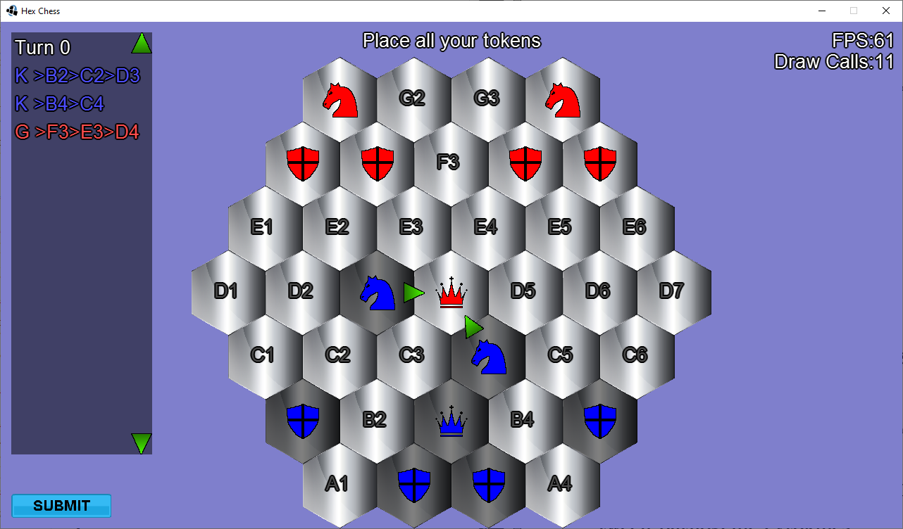

# HexChess

HexChess is a chess style multiplayer game about predicting your opponent's moves and capturing their General. The player gets three game pieces they can place on the board. Two pieces per turn can be moved strategically to flank and engage the enemy. The game pieces consist of three classes: Infantry, Knights, and, most importantly, the General. Infantry are basic pieces that can move by one hexagon per turn. Knights and the General can move up to two hexagons per turn. The player's pieces can engage the opponents to block enemy movement. Keep in mind that certain pieces have different effects based on their classes. Play with your friends over the internet, and if you are cunning enough, you just might be able to win!

HexChess is a personal project that a friend Nathan Yaskiw and I developed. We wanted to create a game similar to Chess but without a well-defined set of patterns and play styles. We have worked toward this goal by allowing the player to arrange their game pieces any way they wish in their starting area. This freedom serves to minimize standard opening moves. During gameplay, player moves are performed concurrently. When both players have submitted moves, the outcome of the round will be resolved and animated.
 

*A screenshot showing the red player's General being surrounded by two blue Knights.*
